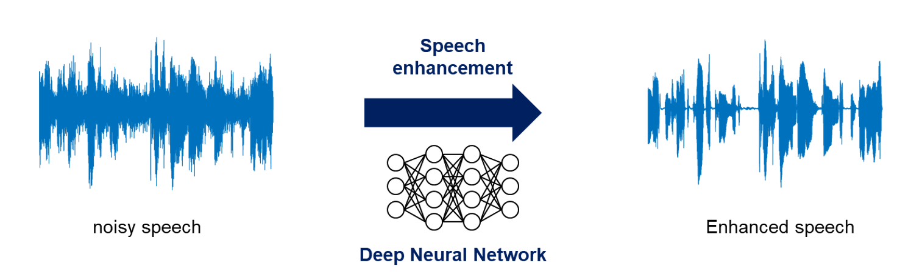
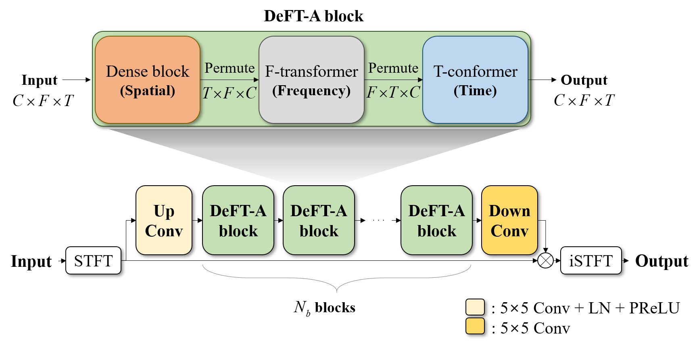
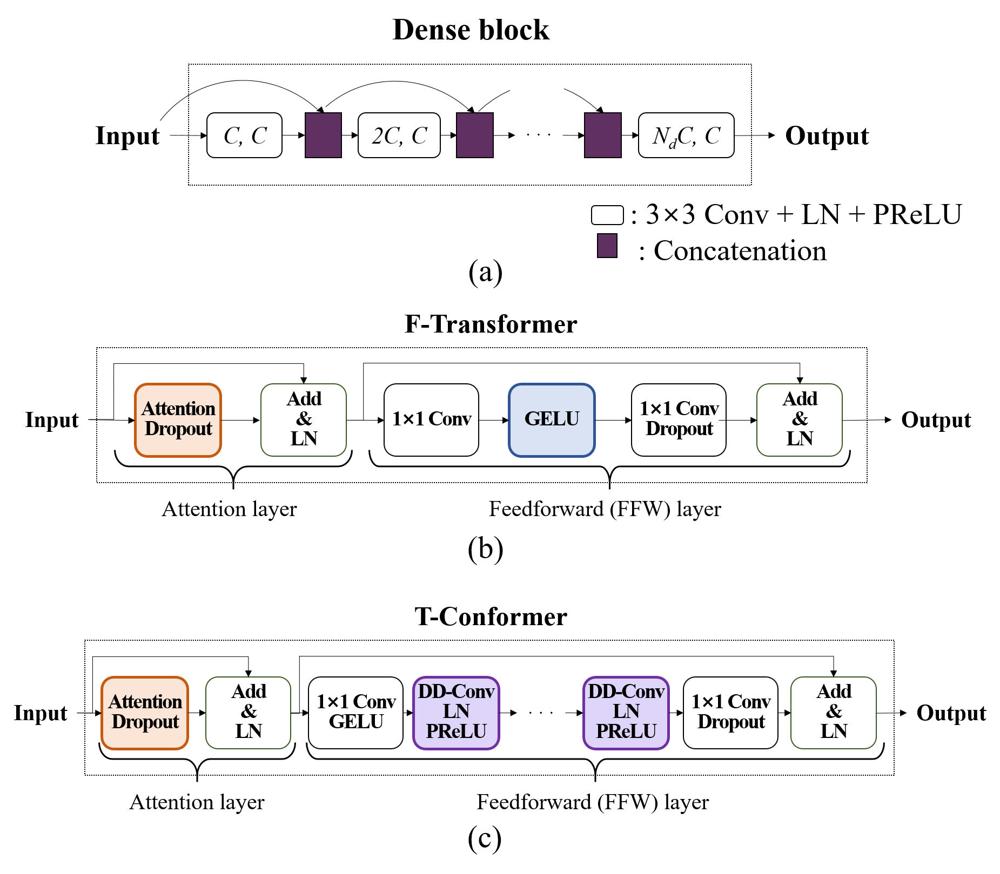
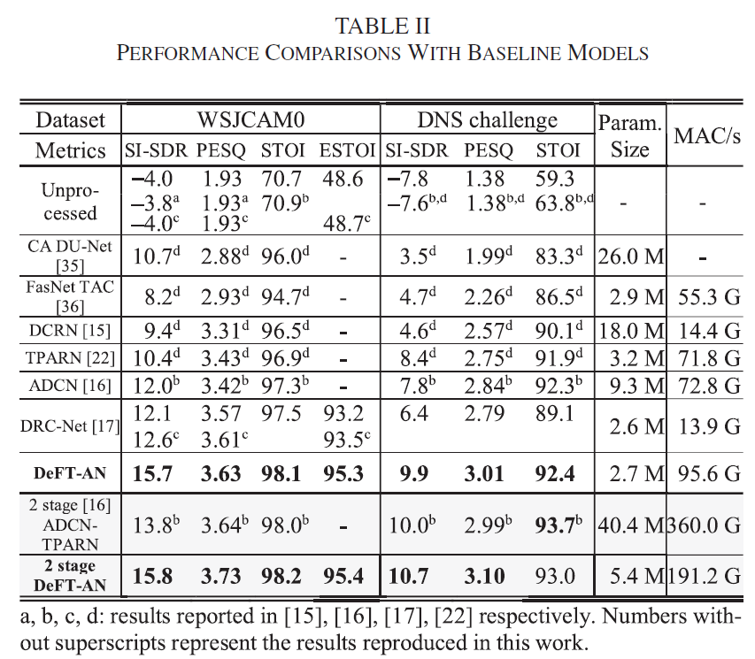

# DeFT-AN: Dense Frequency-Time Attentive Network for multichannel speech enhancement
[D. Lee and J-W. Choi, "DeFT-AN: Dense Frequency-Time Attentive Network for Multichannel Speech Enhancement," IEEE Signal Processing Letters vol.30, pp.155-159, 2023](https://ieeexplore.ieee.org/stamp/stamp.jsp?arnumber=10042963)

In this study, we propose a dense frequency-time attentive network (DeFT-AN) for multichannel speech enhancement. DeFT-AN is a mask estimation network that predicts a complex spectral masking pattern for suppressing the noise and reverberation embedded in the short-time Fourier transform (STFT) of an input signal. The proposed mask estimation network incorporates three different types of blocks for aggregating information in the spatial, spectral, and temporal dimensions. It utilizes a spectral transformer with a modified feed-forward network and a temporal conformer with sequential dilated convolutions. The use of dense blocks and transformers dedicated to the three different characteristics of audio signals enables more comprehensive enhancement in noisy and reverberant environments. The remarkable performance of DeFT-AN over state-of-the-art multichannel models is demonstrated based on two popular noisy and reverberant datasets in terms of various metrics for speech quality and intelligibility.

The DeFT-AN model has a series of sub-blocks consisting of a dense block for aggregating spatial information and two transformer blocks for handling spectral and temporal information, respectively. To enable more comprehensive analysis and synthesis of the spectral information, we
introduce an F-transformer for focusing on the spectral information, followed by a T-conformer designed to realize the parallelizable architecture without losing the local information or receptive field in time. This is possible by combining a temporal convolutional network (TCN) [23] structure with the attention module. Finally, we demonstrate the performance of DeFT-AN relative to other state-of-the-art approaches
based on training and testing over two noisy reverberant datasets.

Both experiments with the spatialized WSJCAM0 dataset and the spatialized DNS challenge dataset show that the DeFTAN outperforms the state-of-the-art models by a large margin in terms of most evaluation measures. Notably, the proposed method exhibits highly improved SI-SDR and PESQ values relative to those of the baseline models. The proposed method was also compared with the two-stage approach using ADCN for the first stage and TPARN for the second stage (ADCN-TPARN). The single-stage performance of the proposed model is similar to that of the two-stage approach, but the 2-stage setting of the proposed model again outperforms ADCN-TPARN. 

http://www.sound.kaist.ac.kr
